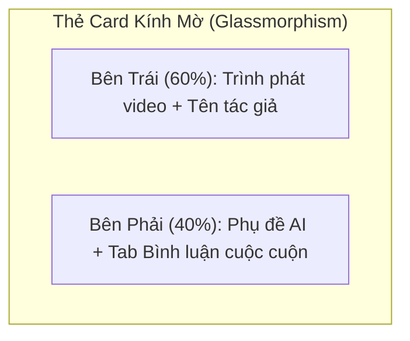
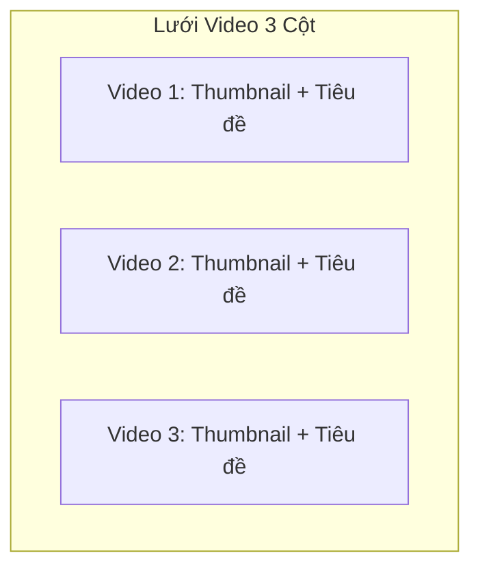

# Đề Xuất Thiết Kế Lại Giao Diện Bảng Tin (Home Feed Redesign Proposal)

Hiện tại, trang **Trang chủ (Home Feed)** hiển thị video theo dạng danh sách cuộn dọc đơn điệu (Single-column vertical stack). Thiết kế này gặp phải một số vấn đề lớn về UX/UI khiến người dùng cảm thấy khó chịu:
* **Quá tải thông tin dọc (Infinite vertical clutter)**: Mỗi video chiếm một diện tích lớn bao gồm Trình phát video, Hộp phụ đề AI và Danh sách bình luận. Khi cuộn trang, người dùng cảm thấy mệt mỏi vì trang quá dài.
* **Thiếu phân cấp thị giác (Visual hierarchy)**: Bình luận và trình phát video xếp chồng lên nhau khiến mắt không biết tập trung vào đâu.
* **Giao diện bình luận thô**: Khu vực viết bình luận nằm khuất bên dưới làm phân tán trải nghiệm xem video.

Dưới đây là 2 phương án thiết kế hiện đại, tinh tế để thay đổi toàn bộ diện mạo của **Home Feed**.

---

## 🛠️ Phương Án 1: Bố Cục Rạp Chiếu Phim Chia Đôi (Cinema Split-Panel Layout) - *Khuyên dùng*

Bố cục này mô phỏng giao diện của **YouTube Desktop** hoặc **TikTok Web**. Mỗi video sẽ được chia làm 2 phần trái-phải rõ ràng thay vì xếp dọc.

### Chi tiết thiết kế:
* **Cột bên trái (60% chiều rộng)**: Hiển thị trình phát video lớn, tiêu đề video và hashtag ngay bên dưới.
* **Cột bên phải (40% chiều rộng)**: 
  * Phía trên là **Hộp phụ đề AI** được thiết kế gọn gàng dạng badge phát sáng.
  * Phía dưới là **Hộp thoại bình luận** có thanh cuộn riêng (`max-height: 250px; overflow-y: auto`). Người dùng có thể vừa xem video vừa đọc bình luận bên cạnh mà không cần cuộn trang.
* **Ưu điểm**: Cực kỳ gọn gàng, mang lại cảm giác xem phim cao cấp (Cinema), tận dụng tối đa chiều rộng màn hình máy tính.

---

## 🎨 Phương Án 2: Bố Cục Dạng Lưới Khám Phá (Pinterest/YouTube Grid Layout)

Bố cục này giống trang chủ **YouTube** hoặc **Instagram Explore**, tổ chức các video thành dạng lưới nhiều cột (2 hoặc 3 cột).

### Chi tiết thiết kế:
* **Hiển thị dạng lưới**: Video hiển thị dưới dạng các thẻ card nhỏ gọn xếp thành 2 hoặc 3 cột trên màn hình. Mỗi thẻ chỉ chứa:
  * Tên tác giả & avatar.
  * Trình phát video nhỏ (hoặc ảnh thumbnail).
  * Tiêu đề và hashtag rút gọn.
* **Trải nghiệm bấm mở rộng (Expandable/Modal Details)**: Khi người dùng quan tâm và bấm vào nút **"Xem chi tiết & Thảo luận"**, thẻ đó sẽ mở rộng xuống dưới (hoặc mở hộp thoại) để hiện Phụ đề AI đầy đủ và khu vực bình luận.
* **Ưu điểm**: Người dùng có thể lướt nhanh qua hàng chục video trong vài giây, dễ dàng tìm kiếm nội dung mình thích trước khi quyết định dừng lại xem chi tiết.

---

## 🗳️ Bạn Lựa Chọn Phương Án Nào?

Vui lòng phản hồi phương án bạn muốn áp dụng:
1. **Phương án 1 (Cinema Split-Panel)**: Tập trung vào trải nghiệm xem video và đọc bình luận song song.
2. **Phương án 2 (Grid Explore)**: Tập trung vào trải nghiệm lướt nhanh nhiều nội dung cùng lúc.
