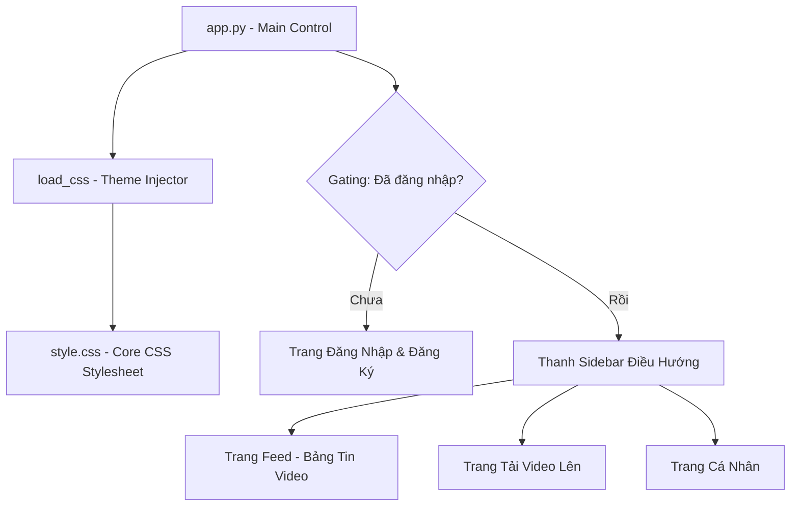

# Đánh Giá & Rà Soát Toàn Bộ Giao Diện Người Dùng (UI/UX) - VideoSocial

Tài liệu này đánh giá chi tiết cấu trúc mã nguồn giao diện, thiết kế thẩm mỹ, các tương tác động, và đề xuất cải tiến cho ứng dụng **VideoSocial**.

---

## 1. Cấu Trúc Thành Phần Giao Diện (Architecture Overview)

Giao diện được xây dựng trên nền tảng **Streamlit (v1.41.1)** kết hợp với phong cách CSS tùy biến qua tệp `style.css`. 

### Các tệp nguồn UI chính:
1. **[app.py](file:///home/vu/PyCharmMiscProject/MSRVTT/video-social-app/frontend/app.py)**: Điều khiển logic hiển thị, quản lý trạng thái phiên làm việc (`st.session_state`), tương tác API backend, và phân luồng các Tab chức năng.
2. **[style.css](file:///home/vu/PyCharmMiscProject/MSRVTT/video-social-app/frontend/style.css)**: Định nghĩa các CSS variables, phông chữ hệ thống, bố cục thẻ card kính mờ (glassmorphism), định dạng thanh cuộn, nút bấm, và các hiệu ứng động (hover micro-animations).

---

## 2. Đánh Giá Chi Tiết Thiết Kế & Mỹ Thuật (Design Evaluation)

### 🎨 2.1. Hệ Thống Màu Sắc & Chủ Đề (Color System & Theming)
Hệ thống sử dụng các biến CSS (`--bg-gradient`, `--text-primary`, `--card-bg`,...) để hỗ trợ chuyển đổi giao diện mượt mà.

| Biến CSS | Light Mode (Mặc định) | Dark Mode | Đánh giá trực quan |
| :--- | :--- | :--- | :--- |
| Nền ứng dụng | `radial-gradient` từ tím nhạt sang xám trắng | `radial-gradient` từ xanh tím vũ trụ sang đen | **Xuất sắc**: Nền gradient tạo chiều sâu không gian, không bị phẳng lì như màu đơn sắc thông thường. |
| Thẻ Card | Nền trắng đục `rgba(255,255,255,0.55)` | Nền tối mờ `rgba(255,255,255,0.02)` | **Đẹp**: Phong cách kính mờ (Glassmorphism) kết hợp `backdrop-filter: blur(20px)` tạo hiệu ứng hiện đại, cao cấp. |
| Màu chữ chính | Xám đậm tối `#0f172a` | Trắng tinh khiết `#ffffff` | **Độ tương phản cao**: Đảm bảo tiêu chuẩn đọc (W3C Contrast Ratio) trên cả nền sáng và nền tối. |

### 📐 2.2. Bố Cục & Không Gian (Layout & Spacing)
* **Loại bỏ cột đệm biên (`col1`, `col3`)**: Việc loại bỏ các cột trống hai bên giúp nội dung bảng tin video và form upload giãn nở tự nhiên. Giao diện trông gọn gàng, không có khoảng hở thừa và không bị lỗi hiển thị các "ô chữ nhật ảo" trên màn hình lớn.
* **Giao diện Đăng nhập rộng rãi hơn**: Việc tăng `max-width` lên `580px` giúp biểu mẫu trông cân đối, khoảng cách giữa các input thoải mái và nút bấm to rõ ràng hơn.

### ✨ 2.3. Các Tương Tác Vi Mô (Micro-interactions & Animations)
* **Nút chuyển đổi giao diện sáng tối (Theme Toggle)**:
  * Trạng thái đăng nhập: Dùng `st.sidebar.selectbox` nằm gọn gàng bên dưới menu điều hướng.
  * Trạng thái login: Nút bấm hình tròn nhỏ nhắn với biểu tượng `☀️` / `🌙` tích hợp hiệu ứng di chuột **phóng to 1.1 lần và tự xoay 15 độ** rất sinh động.
* **Hiệu ứng Card Hover**:
  * Các thẻ video card tự động dịch chuyển lên trên `-4px` (`transform: translateY(-4px)`) và viền thẻ phát sáng màu tím neon nhẹ nhàng khi người dùng rê chuột qua. Điều này giúp kích thích mong muốn bấm vào của người dùng.

---

## 3. Đánh Giá Code Mã Nguồn (Code Quality Review)

> [!NOTE]
> Mã nguồn giao diện trong `app.py` và `style.css` được tổ chức sạch sẽ, tách biệt tương đối giữa phần logic điều khiển Streamlit và lớp hiển thị CSS.

### 🌟 Điểm sáng trong mã nguồn:
1. **Quản lý trạng thái thông minh**: Sử dụng `st.session_state` hiệu quả để đồng bộ hóa trạng thái hiển thị phụ đề AI (`revealed_captions`) và bộ nhớ tạm tên người dùng (`users_map`), tránh việc gọi API quá nhiều lần gây nghẽn băng thông.
2. **Xử lý bất đồng bộ hợp lý**: Các tác vụ nặng như sinh phụ đề AI (`generate_caption`) và upload tệp tin lớn được bọc trong bộ chỉ thị tiến trình (`st.spinner`) trực quan.
3. **Tương thích cao**: Sử dụng các đơn vị đo tương đối như `rem`, `vh`, `%` giúp giao diện hiển thị co giãn linh hoạt trên nhiều kích thước màn hình khác nhau.

---

## 4. Khuyến Nghị & Đề Xuất Cải Tiến (Recommendations)

> [!TIP]
> Để ứng dụng trở nên hoàn hảo hơn trong các phiên bản tiếp theo, hãy cân nhắc một số cải tiến nhỏ sau:

1. **Hiển thị tiến trình sinh phụ đề AI**: Hiện tại, khi chạy dịch AI, màn hình chỉ hiện spinner xoay. Nếu backend hỗ trợ, có thể hiển thị tiến trình dạng phần trăm (%) hoặc thông báo trạng thái từng bước (ví dụ: *Đang trích xuất âm thanh -> Đang phân tích giọng nói -> Đang dịch nghĩa*).
2. **Tối ưu hóa tải ảnh đại diện**: Phần thông tin cá nhân hiện tại đang sử dụng emoji làm avatar `👤`. Có thể cho phép người dùng đăng tải ảnh đại diện (avatar) thật của họ để tăng tính cá nhân hóa.
3. **Thông báo hệ thống (Toasts)**: Thay vì sử dụng `st.success` hoặc `st.error` chiếm diện tích ở giữa màn hình, có thể dùng `st.toast` để hiển thị các thông báo ngắn góc dưới màn hình.
